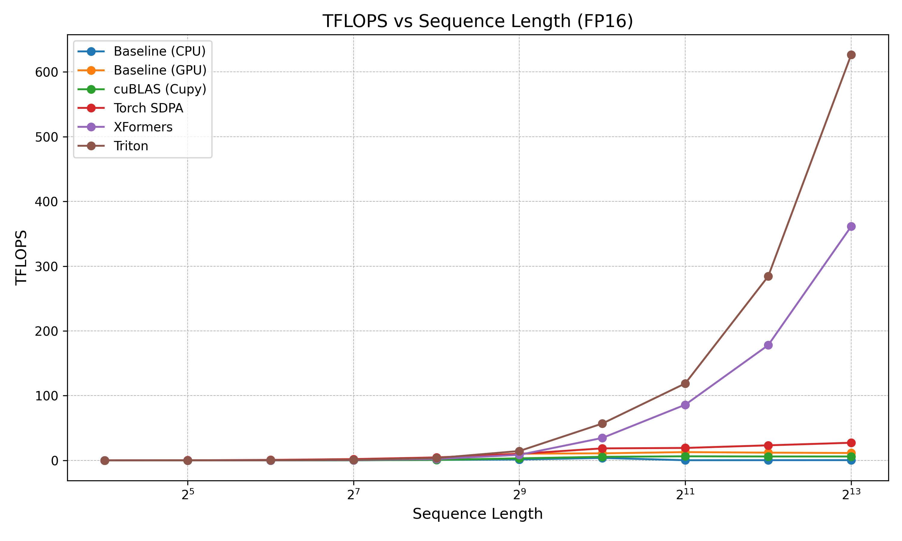

## Performance Benchmarking of Attention Operators



### Quick Start

```shell
# pip install -r requirements.txt (optional)
python benchmark.py
python inference_benchmark.py
```

### Performance Benchmark in Single V100-32GB

#### Software Environment

+ `CUDA Toolkit` 12.2 (Driver Version 535.247.01)

+ `torch` 2.7.0+cu126

+ `triton` 3.3.0

+ `xformers` 0.0.30

+ `cupy` 13.4.1

#### Hardware Environment

+ `CPU` INTEL(R) XEON(R) GOLD 6542Y (x86_64) 48 Cores

+ `GPU` Tesla V100-PCIE-32GB

#### Performance Benchmark Result

##### Attention

```shell
Baseline (cpu) (torch.float32)
  SeqLen=16     Speed=   187167.38 tokens/s  TFLOPS=   0.01
  SeqLen=32     Speed=   573800.73 tokens/s  TFLOPS=   0.04
  SeqLen=64     Speed=   765558.57 tokens/s  TFLOPS=   0.10
  SeqLen=128    Speed=  1166780.94 tokens/s  TFLOPS=   0.31
  SeqLen=256    Speed=   218966.98 tokens/s  TFLOPS=   0.11
  SeqLen=512    Speed=   222434.13 tokens/s  TFLOPS=   0.23
  SeqLen=1024   Speed=   106402.96 tokens/s  TFLOPS=   0.22
  SeqLen=2048   Speed=    47679.82 tokens/s  TFLOPS=   0.20
  SeqLen=4096   Speed=    24964.25 tokens/s  TFLOPS=   0.21
  SeqLen=8192   Speed=    13947.20 tokens/s  TFLOPS=   0.23

Baseline (cpu) FP16 (torch.float16)
  SeqLen=16     Speed=   174830.96 tokens/s  TFLOPS=   0.01
  SeqLen=32     Speed=   362809.45 tokens/s  TFLOPS=   0.02
  SeqLen=64     Speed=   581646.02 tokens/s  TFLOPS=   0.08
  SeqLen=128    Speed=   939406.67 tokens/s  TFLOPS=   0.25
  SeqLen=256    Speed=  1506921.47 tokens/s  TFLOPS=   0.79
  SeqLen=512    Speed=  1359055.04 tokens/s  TFLOPS=   1.43
  SeqLen=1024   Speed=  1852189.13 tokens/s  TFLOPS=   3.88
  SeqLen=2048   Speed=    70078.95 tokens/s  TFLOPS=   0.29
  SeqLen=4096   Speed=    44646.53 tokens/s  TFLOPS=   0.37
  SeqLen=8192   Speed=    25640.54 tokens/s  TFLOPS=   0.43

Baseline (gpu) (torch.float32)
  SeqLen=16     Speed=   499024.87 tokens/s  TFLOPS=   0.02
  SeqLen=32     Speed=   991561.23 tokens/s  TFLOPS=   0.06
  SeqLen=64     Speed=  2023789.63 tokens/s  TFLOPS=   0.27
  SeqLen=128    Speed=  4010090.47 tokens/s  TFLOPS=   1.05
  SeqLen=256    Speed=  4995542.12 tokens/s  TFLOPS=   2.62
  SeqLen=512    Speed=  3199898.15 tokens/s  TFLOPS=   3.36
  SeqLen=1024   Speed=  1964230.74 tokens/s  TFLOPS=   4.12
  SeqLen=2048   Speed=  1312470.33 tokens/s  TFLOPS=   5.50
  SeqLen=4096   Speed=   700420.96 tokens/s  TFLOPS=   5.88
  SeqLen=8192   Speed=   322441.36 tokens/s  TFLOPS=   5.41

Baseline (gpu) FP32 (torch.float16)
  SeqLen=16     Speed=   506023.71 tokens/s  TFLOPS=   0.02
  SeqLen=32     Speed=  1010751.77 tokens/s  TFLOPS=   0.07
  SeqLen=64     Speed=  2015735.20 tokens/s  TFLOPS=   0.26
  SeqLen=128    Speed=  4015188.93 tokens/s  TFLOPS=   1.05
  SeqLen=256    Speed=  8044215.04 tokens/s  TFLOPS=   4.22
  SeqLen=512    Speed=  9903540.16 tokens/s  TFLOPS=  10.38
  SeqLen=1024   Speed=  5220194.58 tokens/s  TFLOPS=  10.95
  SeqLen=2048   Speed=  3062692.83 tokens/s  TFLOPS=  12.85
  SeqLen=4096   Speed=  1428096.24 tokens/s  TFLOPS=  11.98
  SeqLen=8192   Speed=   683042.28 tokens/s  TFLOPS=  11.46

cuBLAS (cupy) (torch.float32)
  SeqLen=16     Speed=   102606.67 tokens/s  TFLOPS=   0.00
  SeqLen=32     Speed=   233041.16 tokens/s  TFLOPS=   0.02
  SeqLen=64     Speed=   467771.68 tokens/s  TFLOPS=   0.06
  SeqLen=128    Speed=   912719.80 tokens/s  TFLOPS=   0.24
  SeqLen=256    Speed=  1847138.87 tokens/s  TFLOPS=   0.97
  SeqLen=512    Speed=  3240262.01 tokens/s  TFLOPS=   3.40
  SeqLen=1024   Speed=  2058771.20 tokens/s  TFLOPS=   4.32
  SeqLen=2048   Speed=  1353724.12 tokens/s  TFLOPS=   5.68
  SeqLen=4096   Speed=   697663.91 tokens/s  TFLOPS=   5.85
  SeqLen=8192   Speed=   324082.68 tokens/s  TFLOPS=   5.44

cuBLAS (cupy) FP16 (torch.float16)
  SeqLen=16     Speed=    95945.19 tokens/s  TFLOPS=   0.00
  SeqLen=32     Speed=   192462.72 tokens/s  TFLOPS=   0.01
  SeqLen=64     Speed=   386973.04 tokens/s  TFLOPS=   0.05
  SeqLen=128    Speed=   772776.35 tokens/s  TFLOPS=   0.20
  SeqLen=256    Speed=  1545241.30 tokens/s  TFLOPS=   0.81
  SeqLen=512    Speed=  3074245.78 tokens/s  TFLOPS=   3.22
  SeqLen=1024   Speed=  2658780.42 tokens/s  TFLOPS=   5.58
  SeqLen=2048   Speed=  1514894.15 tokens/s  TFLOPS=   6.35
  SeqLen=4096   Speed=   728506.32 tokens/s  TFLOPS=   6.11
  SeqLen=8192   Speed=   363281.65 tokens/s  TFLOPS=   6.09

Torch SDPA (torch.float32)
  SeqLen=16     Speed=  1146572.08 tokens/s  TFLOPS=   0.04
  SeqLen=32     Speed=  2176386.05 tokens/s  TFLOPS=   0.14
  SeqLen=64     Speed=  3864048.60 tokens/s  TFLOPS=   0.51
  SeqLen=128    Speed=  4478402.67 tokens/s  TFLOPS=   1.17
  SeqLen=256    Speed=  4852631.73 tokens/s  TFLOPS=   2.54
  SeqLen=512    Speed=  5040804.77 tokens/s  TFLOPS=   5.29
  SeqLen=1024   Speed=  3472925.77 tokens/s  TFLOPS=   7.28
  SeqLen=2048   Speed=  1628926.97 tokens/s  TFLOPS=   6.83
  SeqLen=4096   Speed=   897418.68 tokens/s  TFLOPS=   7.53
  SeqLen=8192   Speed=   519348.97 tokens/s  TFLOPS=   8.71

Torch SDPA FP16 (torch.float16)
  SeqLen=16     Speed=  1587248.44 tokens/s  TFLOPS=   0.05
  SeqLen=32     Speed=  3164019.99 tokens/s  TFLOPS=   0.21
  SeqLen=64     Speed=  6006611.23 tokens/s  TFLOPS=   0.79
  SeqLen=128    Speed=  7687155.10 tokens/s  TFLOPS=   2.02
  SeqLen=256    Speed=  8857063.63 tokens/s  TFLOPS=   4.64
  SeqLen=512    Speed=  9679890.23 tokens/s  TFLOPS=  10.15
  SeqLen=1024   Speed=  8868768.68 tokens/s  TFLOPS=  18.60
  SeqLen=2048   Speed=  4594702.73 tokens/s  TFLOPS=  19.27
  SeqLen=4096   Speed=  2778852.93 tokens/s  TFLOPS=  23.31
  SeqLen=8192   Speed=  1627140.41 tokens/s  TFLOPS=  27.30

XFormers (torch.float32)
  SeqLen=16     Speed=   245550.18 tokens/s  TFLOPS=   0.01
  SeqLen=32     Speed=   491424.02 tokens/s  TFLOPS=   0.03
  SeqLen=64     Speed=   986061.26 tokens/s  TFLOPS=   0.13
  SeqLen=128    Speed=  1964976.62 tokens/s  TFLOPS=   0.52
  SeqLen=256    Speed=  3985086.94 tokens/s  TFLOPS=   2.09
  SeqLen=512    Speed=  7820121.80 tokens/s  TFLOPS=   8.20
  SeqLen=1024   Speed= 10405483.32 tokens/s  TFLOPS=  21.82
  SeqLen=2048   Speed= 11330723.24 tokens/s  TFLOPS=  47.52
  SeqLen=4096   Speed= 11399818.97 tokens/s  TFLOPS=  95.63
  SeqLen=8192   Speed= 11496203.60 tokens/s  TFLOPS= 192.87

XFormers FP16 (torch.float16)
  SeqLen=16     Speed=   263886.06 tokens/s  TFLOPS=   0.01
  SeqLen=32     Speed=   520788.95 tokens/s  TFLOPS=   0.03
  SeqLen=64     Speed=  1041456.67 tokens/s  TFLOPS=   0.14
  SeqLen=128    Speed=  2094370.41 tokens/s  TFLOPS=   0.55
  SeqLen=256    Speed=  4157600.19 tokens/s  TFLOPS=   2.18
  SeqLen=512    Speed=  8243066.36 tokens/s  TFLOPS=   8.64
  SeqLen=1024   Speed= 16556037.68 tokens/s  TFLOPS=  34.72
  SeqLen=2048   Speed= 20510337.84 tokens/s  TFLOPS=  86.03
  SeqLen=4096   Speed= 21222029.06 tokens/s  TFLOPS= 178.02
  SeqLen=8192   Speed= 21536889.64 tokens/s  TFLOPS= 361.33

Triton (torch.float32)
  SeqLen=16     Speed=   382168.93 tokens/s  TFLOPS=   0.01
  SeqLen=32     Speed=   829528.60 tokens/s  TFLOPS=   0.05
  SeqLen=64     Speed=  1667508.11 tokens/s  TFLOPS=   0.22
  SeqLen=128    Speed=  3400930.65 tokens/s  TFLOPS=   0.89
  SeqLen=256    Speed=  6770551.89 tokens/s  TFLOPS=   3.55
  SeqLen=512    Speed= 13560770.70 tokens/s  TFLOPS=  14.22
  SeqLen=1024   Speed= 17955548.90 tokens/s  TFLOPS=  37.66
  SeqLen=2048   Speed= 18603804.37 tokens/s  TFLOPS=  78.03
  SeqLen=4096   Speed= 20120005.60 tokens/s  TFLOPS= 168.78
  SeqLen=8192   Speed= 22391196.18 tokens/s  TFLOPS= 375.66

Triton FP16 (torch.float16)
  SeqLen=16     Speed=   432681.26 tokens/s  TFLOPS=   0.01
  SeqLen=32     Speed=   866200.25 tokens/s  TFLOPS=   0.06
  SeqLen=64     Speed=  1731283.17 tokens/s  TFLOPS=   0.23
  SeqLen=128    Speed=  3476242.63 tokens/s  TFLOPS=   0.91
  SeqLen=256    Speed=  6935868.64 tokens/s  TFLOPS=   3.64
  SeqLen=512    Speed= 13855627.12 tokens/s  TFLOPS=  14.53
  SeqLen=1024   Speed= 27157554.83 tokens/s  TFLOPS=  56.95
  SeqLen=2048   Speed= 28352426.29 tokens/s  TFLOPS= 118.92
  SeqLen=4096   Speed= 33897378.13 tokens/s  TFLOPS= 284.35
  SeqLen=8192   Speed= 37336178.52 tokens/s  TFLOPS= 626.40
```

##### GPT-3 Inference

```shell
Benchmarking GPT-3 structure with different attention implementations

===== FP32 Benchmark =====

--- Sequence Length: 256 ---
Baseline (cpu) FP32 (seq_len=256): 6845.46 tokens/s, 37.40 ms/iter
Baseline (gpu) FP32 (seq_len=256): 30903.49 tokens/s, 8.28 ms/iter
cuBLAS FP32 (seq_len=256): 31545.71 tokens/s, 8.12 ms/iter
Torch SDPA FP32 (seq_len=256): 32403.11 tokens/s, 7.90 ms/iter
XFormers FP32 (seq_len=256): 33399.07 tokens/s, 7.66 ms/iter
Triton FP32 (seq_len=256): 31324.93 tokens/s, 8.17 ms/iter

--- Sequence Length: 1024 ---
Baseline (cpu) FP32 (seq_len=1024): 3552.13 tokens/s, 288.28 ms/iter
Baseline (gpu) FP32 (seq_len=1024): 33104.71 tokens/s, 30.93 ms/iter
cuBLAS FP32 (seq_len=1024): 32940.25 tokens/s, 31.09 ms/iter
Torch SDPA FP32 (seq_len=1024): 35867.15 tokens/s, 28.55 ms/iter
XFormers FP32 (seq_len=1024): 40858.09 tokens/s, 25.06 ms/iter
Triton FP32 (seq_len=1024): 40541.93 tokens/s, 25.26 ms/iter

--- Sequence Length: 4096 ---
Baseline (cpu) FP32 (seq_len=4096): 1318.10 tokens/s, 3107.51 ms/iter
Baseline (gpu) FP32 (seq_len=4096): 21314.98 tokens/s, 192.17 ms/iter
cuBLAS FP32 (seq_len=4096): 21294.51 tokens/s, 192.35 ms/iter
Torch SDPA FP32 (seq_len=4096): 25224.53 tokens/s, 162.38 ms/iter
XFormers FP32 (seq_len=4096): 45008.93 tokens/s, 91.00 ms/iter
Triton FP32 (seq_len=4096): 45482.47 tokens/s, 90.06 ms/iter

===== FP16 Benchmark =====

--- Sequence Length: 256 ---
Baseline (cpu) FP16 (seq_len=256): 7206.47 tokens/s, 35.52 ms/iter
Baseline (gpu) FP16 (seq_len=256): 79759.76 tokens/s, 3.21 ms/iter
cuBLAS FP16 (seq_len=256): 54782.61 tokens/s, 4.67 ms/iter
Torch SDPA FP16 (seq_len=256): 79432.29 tokens/s, 3.22 ms/iter
XFormers FP16 (seq_len=256): 82186.80 tokens/s, 3.11 ms/iter
Triton FP16 (seq_len=256): 75712.66 tokens/s, 3.38 ms/iter

--- Sequence Length: 1024 ---
Baseline (cpu) FP16 (seq_len=1024): 7686.79 tokens/s, 133.22 ms/iter
Baseline (gpu) FP16 (seq_len=1024): 99776.57 tokens/s, 10.26 ms/iter
cuBLAS FP16 (seq_len=1024): 77336.01 tokens/s, 13.24 ms/iter
Torch SDPA FP16 (seq_len=1024): 121304.83 tokens/s, 8.44 ms/iter
XFormers FP16 (seq_len=1024): 139249.42 tokens/s, 7.35 ms/iter
Triton FP16 (seq_len=1024): 132013.92 tokens/s, 7.76 ms/iter

--- Sequence Length: 4096 ---
Baseline (cpu) FP16 (seq_len=4096): 1965.43 tokens/s, 2084.03 ms/iter
Baseline (gpu) FP16 (seq_len=4096): 57713.83 tokens/s, 70.97 ms/iter
cuBLAS FP16 (seq_len=4096): 34398.90 tokens/s, 119.07 ms/iter
Torch SDPA FP16 (seq_len=4096): 89211.34 tokens/s, 45.91 ms/iter
XFormers FP16 (seq_len=4096): 170953.33 tokens/s, 23.96 ms/iter
Triton FP16 (seq_len=4096): 170263.17 tokens/s, 24.06 ms/iter
```